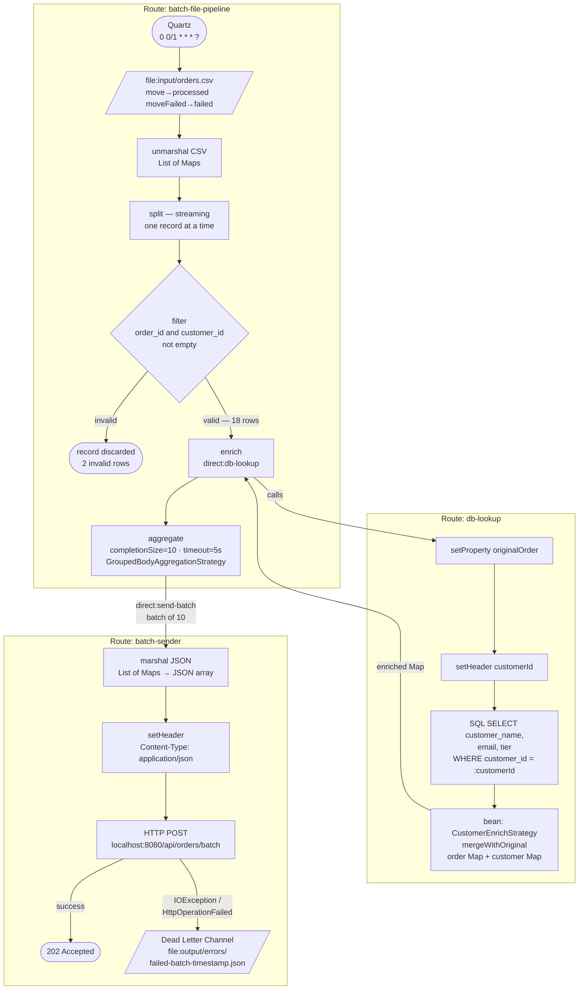

# Batch Order Pipeline

## Overview

A file-based batch integration pipeline. The system reads a CSV file of orders, enriches each record with customer data from a PostgreSQL database, groups records into batches of 10, and sends them to a REST API with automatic error handling via Dead Letter Channel.

### EIP Patterns Used

| Pattern | Where | Description |
|---------|-------|-------------|
| **Splitter** | `batch-pipeline.camel.yaml` | Splits the CSV list into individual records |
| **Content Enricher** | `batch-pipeline.camel.yaml` | Enriches each order with customer data from PostgreSQL |
| **Aggregator** | `batch-pipeline.camel.yaml` | Groups enriched records (Maps) into batches of 10 |
| **Dead Letter Channel** | `batch-sender.camel.yaml` | Writes failed batches to `output/errors/` after 3 retries |

### Execution Flow



### Test Data

The sample CSV (`input/orders.csv`) contains 20 rows:
- **18 valid orders** that pass the filter and are processed (with a `completionTimeout` of 5 s you get: 1 full batch of 10 + 1 partial batch of 8)
- **2 invalid rows** (ORD-011 with no `customer_id`, and row 19 with no `order_id`) that are discarded by the filter

## Prerequisites

See [Prerequisites](../README.md#prerequisites) in the root README. Docker and Docker Compose are required for this example.

## Running the Example

### 1. Start the infrastructure

```bash
docker compose up -d
```

This starts:
- **PostgreSQL** on `localhost:5433` (database `ordersdb`, table `customers` with 8 sample customers)
- **WireMock** on `localhost:8080` (stub `POST /api/orders/batch` → HTTP 202)

Wait until both services are healthy before proceeding:

```bash
docker compose ps
```

### 2. Run the pipeline

From the `batch-order-pipeline/` directory:

```bash
camel run batch-pipeline.camel.yaml batch-sender.camel.yaml CustomerEnrichStrategy.java DataSourceConfig.java
```

This command compiles both Java files. JBang resolves all `//DEPS` declarations automatically:
- `DataSourceConfig.java` — registers the PostgreSQL datasource as a named bean (`dataSource`) via `@BindToRegistry`
- `CustomerEnrichStrategy.java` — provides the order/customer merge logic and pulls in `camel-quartz`

> **Note:** The route is configured with a Quartz scheduler (`0 0/1 * * * ?` = every 1 minute). For manual testing, remove the scheduler parameters as described below.

#### Manual trigger (development)

To test immediately without waiting for the cron, edit the `from` block in `batch-pipeline.camel.yaml`:

```yaml
from:
  uri: file:input
  parameters:
    include: ".*\\.csv"
    move: processed
    moveFailed: failed
```

Remove the two `scheduler:` and `scheduler.cron:` lines. The file is picked up as soon as it appears in the `input/` folder.

### 3. Observe the output

The logs trace the full flow:

```
Batch job started — file: orders.csv (XXX bytes)
CSV parsed — 20 rows loaded, splitting into individual records
Customer found for CUST-001: Acme Corp (gold)
Customer found for CUST-002: Globex Industries (silver)
...
Batch complete — dispatching 10 orders
Sending batch of 10 orders to REST API
Batch accepted by API — HTTP 202
Batch complete — dispatching 8 orders
Sending batch of 8 orders to REST API
Batch accepted by API — HTTP 202
```

Successfully processed files are moved to `processed/`. Files that cause a route-level error are moved to `failed/`.

### 4. Simulate a failure (Dead Letter Channel)

To see the Dead Letter Channel in action, stop the mock API:

```bash
docker compose stop mock-api
```

The pipeline retries 3 times with exponential backoff, then writes the failed batch to `output/errors/`.

### 5. Open in Kaoto

Open `batch-pipeline.camel.yaml` and `batch-sender.camel.yaml` in the [Kaoto VS Code extension](https://marketplace.visualstudio.com/items?itemName=redhat.vscode-kaoto).

Kaoto renders:
- **Split node** with the internal sub-flow
- **Filter node** showing the validation predicate
- **Enrich node** (Content Enricher) calling `direct:db-lookup`
- **Aggregate node** with the configured `completionSize`
- **errorHandler** with the Dead Letter Channel in `batch-sender.camel.yaml`

### 6. Stop the infrastructure

```bash
docker compose down
```

To also remove the persistent volume:

```bash
docker compose down -v
```

## Project Structure

```text
batch-order-pipeline/
├── batch-pipeline.camel.yaml      # Main route: read → split → filter → enrich → marshal → aggregate
├── batch-sender.camel.yaml        # Sender route: HTTP POST with Dead Letter Channel
├── CustomerEnrichStrategy.java    # Bean: merges customer data into the order (Content Enricher strategy)
├── DataSourceConfig.java          # Registers PostgreSQL datasource via @BindToRegistry
├── application.properties         # Camel main logging configuration
├── docker-compose.yml             # PostgreSQL + WireMock
├── db/
│   └── init.sql                   # Schema and seed data (customers table)
├── wiremock/
│   └── mappings/
│       └── orders-batch.json      # WireMock stub: POST /api/orders/batch → 202
├── input/
│   └── orders.csv                 # 20 sample orders (2 invalid to exercise the filter)
├── output/
│   └── errors/                    # Dead Letter Channel: failed batches land here
├── processed/                     # CSV files successfully processed
└── failed/                        # CSV files that caused a route-level error
```

## Camel Components Used

| Component | Dependency | Purpose |
|-----------|-----------|---------|
| `camel-file` | included in core | Reads CSV files from the `input/` folder |
| `camel-quartz` | `camel-quartz` | Cron scheduler — declared via `//DEPS` in `CustomerEnrichStrategy.java` |
| `camel-csv` | `camel-csv` | Unmarshals CSV → `List<Map<String, String>>` |
| `camel-sql` | `camel-sql` | PostgreSQL query for the Content Enricher |
| `camel-jackson` | `camel-jackson` | Marshals enriched records to JSON |
| `camel-http` | `camel-http` | HTTP POST of batches to the REST API |
