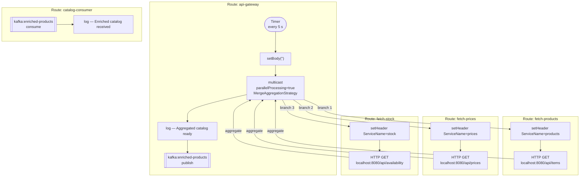

# REST API Orchestration — Scatter-Gather

## Overview

An internal API gateway that aggregates product catalog data from three independent REST microservices (products, prices, and stock) into a single enriched message, then publishes it to a Kafka topic.

All three service calls are executed **in parallel** using the Scatter-Gather EIP. The responses are merged by a custom `MergeAggregationStrategy` bean that builds a composite JSON object keyed by service name.

### EIP Patterns Used

| Pattern | Where | Description |
|---------|-------|-------------|
| **Scatter-Gather** | `api-aggregator.camel.yaml` — `multicast` with `parallelProcessing: true` | Fans out a single request to three microservices concurrently |
| **Aggregator** | `MergeAggregationStrategy.java` | Merges the three JSON responses into one composite object |
| **Content Enricher** | `fetch-products`, `fetch-prices`, `fetch-stock` routes | Each direct route enriches the exchange with data from an external HTTP service |

### Execution Flow



### Aggregated Output

Each Kafka message contains a single JSON object with the three service responses merged under their respective keys:

```json
{
  "products": [
    {"id": "P1", "name": "Widget A", "category": "electronics"},
    {"id": "P2", "name": "Gadget B", "category": "accessories"},
    {"id": "P3", "name": "Device C", "category": "electronics"}
  ],
  "prices": [
    {"productId": "P1", "price": 29.99, "currency": "EUR"},
    {"productId": "P2", "price": 14.50, "currency": "EUR"},
    {"productId": "P3", "price": 89.00, "currency": "EUR"}
  ],
  "stock": [
    {"productId": "P1", "available": true, "stock": 150},
    {"productId": "P2", "available": true, "stock": 42},
    {"productId": "P3", "available": false, "stock": 0}
  ]
}
```

## Prerequisites

See [Prerequisites](../README.md#prerequisites) in the root README. Docker and Docker Compose are required for this example.

## Running the Example

### 1. Start the infrastructure

```bash
docker compose up -d
```

This starts:
- **WireMock** on `localhost:8080` — stubs all three REST endpoints
- **Kafka broker** on `localhost:9092` — receives the enriched catalog messages

Wait until both services are healthy:

```bash
docker compose ps
```

### 2. Run the routes

From the `rest-api-aggregator/` directory:

```bash
camel run api-aggregator.camel.yaml MergeAggregationStrategy.java
```

JBang resolves the `//DEPS` declaration in `MergeAggregationStrategy.java` automatically (`camel-jackson` pulls in Jackson Databind).

### 3. Observe the output

Every 5 seconds you will see:

```
[gateway] Fetching catalog from 3 microservices...
[gateway] Aggregated catalog ready — publishing to Kafka
[consumer] Enriched catalog received: {"products":[...],"prices":[...],"stock":[...]}
```

The three HTTP calls in the `multicast` run in parallel — the total latency is bounded by the slowest single service call, not the sum of all three.

### 4. Open in Kaoto

Open `api-aggregator.camel.yaml` in the [Kaoto VS Code extension](https://marketplace.visualstudio.com/items?itemName=redhat.vscode-kaoto).

Kaoto renders:
- **Multicast node** (Scatter-Gather) with the three outgoing branches
- **Three direct sub-routes** as separate diagrams (Content Enricher)
- **Kafka producer** and **Kafka consumer** as endpoint nodes

### 5. Stop the infrastructure

```bash
docker compose down
```

## Project Structure

```text
rest-api-aggregator/
├── api-aggregator.camel.yaml      # All routes: gateway (Scatter-Gather), three fetch sub-routes, consumer
├── MergeAggregationStrategy.java  # Aggregation bean: merges three JSON responses by ServiceName header
├── application.properties         # Camel startup logging config
├── docker-compose.yml             # WireMock (mock REST services) + Kafka broker
└── wiremock/
    └── mappings/
        ├── products.json          # Stub: GET /api/items → product list
        ├── prices.json            # Stub: GET /api/prices → price list
        └── availability.json      # Stub: GET /api/availability → stock list
```

## Camel Components Used

| Component | Dependency | Purpose |
|-----------|-----------|---------|
| `camel-timer` | included in core | Triggers the scatter-gather every 5 s |
| `camel-http` | `camel-http` | HTTP GET calls to the three microservices |
| `camel-kafka` | `camel-kafka` | Publishes and consumes the enriched catalog |
| `camel-jackson` | `camel-jackson` (via `//DEPS`) | JSON merge in `MergeAggregationStrategy` |
