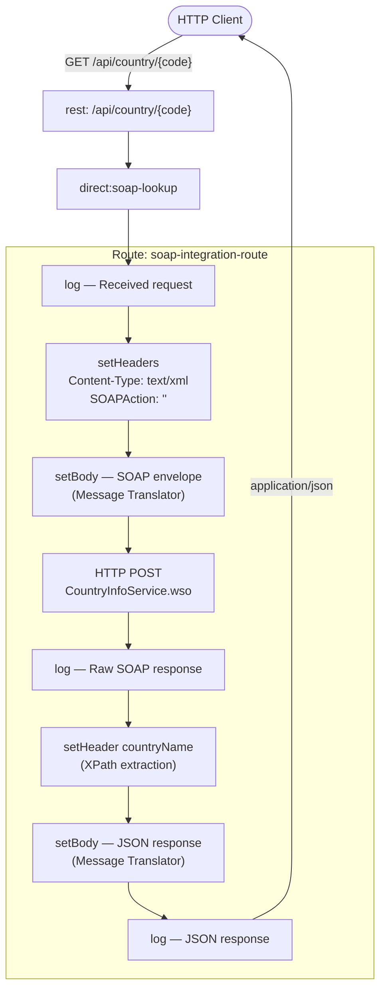

# SOAP Sample — REST-to-SOAP Bridge

## Overview

A REST façade that delegates to a **SOAP web service** and returns a JSON response. The route exposes a single REST endpoint, translates the incoming request into a SOAP envelope, calls a public country-info service, and converts the XML response back to JSON.

No local infrastructure is required — the example targets the public endpoint `http://webservices.oorsprong.org/websamples.countryinfo/CountryInfoService.wso`.

### EIP Patterns Used

| Pattern | Where | Description |
|---------|-------|-------------|
| **Message Translator** | `soap-sample.camel.yaml` — `setBody` (SOAP envelope) and `setBody` (JSON response) | Translates the REST request into a SOAP XML envelope outbound, and the SOAP XML response into a JSON object inbound |
| **Messaging Bridge** | `soap-sample.camel.yaml` — REST `rest:` DSL → `direct:soap-lookup` → `http:` | Bridges the REST protocol to the SOAP/HTTP protocol, decoupling the two transport models |

### Execution Flow



## Prerequisites

See [Prerequisites](../README.md#prerequisites) in the root README. No Docker is required for this example.

## Running the Example

From the `soap-sample/` directory:

```bash
camel run soap-sample.camel.yaml
```

Then call the endpoint:

```bash
curl "http://localhost:8080/api/country/IT"
```

Expected response:

```json
{"code": "IT", "name": "Italy"}
```

### Open in Kaoto

Open `soap-sample.camel.yaml` in the [Kaoto VS Code extension](https://marketplace.visualstudio.com/items?itemName=redhat.vscode-kaoto) to visualise and edit the route graphically.

## How It Works

1. **`rest: GET /api/country/{code}`** — exposes the REST endpoint; the `{code}` path parameter is available as `${header.code}`.
2. **`setHeaders`** — sets `Content-Type: text/xml; charset=utf-8` and an empty `SOAPAction` header required by the service.
3. **`setBody` (SOAP envelope)** — builds the SOAP request using Simple expression language, injecting `${header.code}` into the `<web:sCountryISOCode>` element *(Message Translator — REST → SOAP)*.
4. **`to: http://...`** — POSTs the envelope to the SOAP endpoint *(Messaging Bridge crossing protocol boundary)*.
5. **`log`** — prints the raw XML response.
6. **`setHeader countryName` (XPath)** — extracts the `CountryNameResult` text node from the response.
7. **`setBody` (JSON)** — assembles the final JSON payload from the `code` and `countryName` headers *(Message Translator — SOAP → JSON)*.
8. **`log`** — prints the JSON response.

## Project Structure

```text
soap-sample/
└── soap-sample.camel.yaml    # REST-to-SOAP bridge (Message Translator + Messaging Bridge)
```

## Camel Components Used

| Component | Dependency | Purpose |
| --------- | ---------- | ------- |
| `camel-rest` | included in core | Exposes the REST endpoint |
| `camel-http` | `camel-http` | HTTP POST to the SOAP service |
| `camel-xpath` | included in core | Extracts `CountryNameResult` from the XML response |
